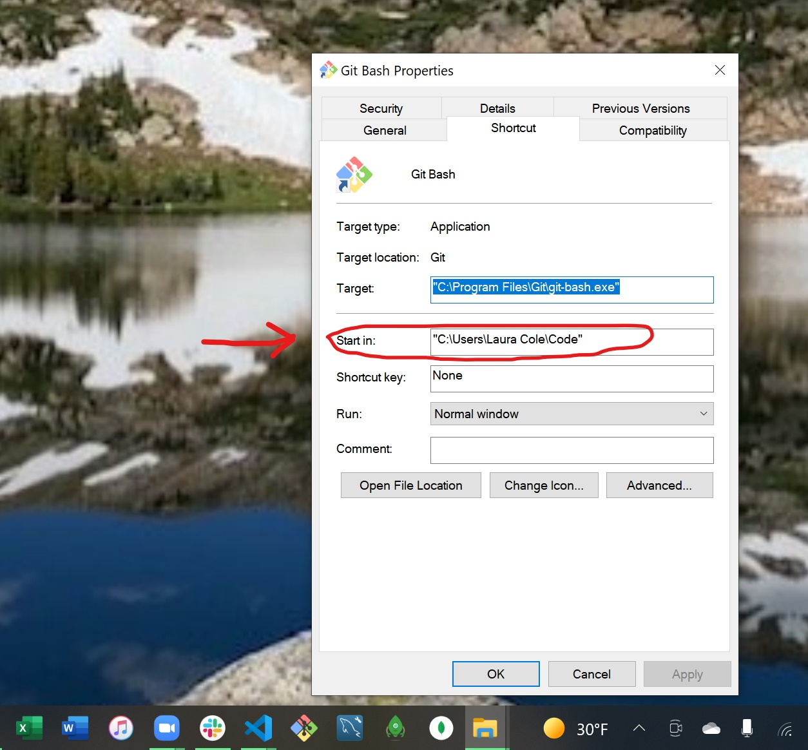

# Changing the default directory in which your Git Bash shortcut opens

It's nice as a Windows user to have your Git Bash open into the directory in which your code lives. Good news: it's not hard to change that!

### Step 1:

Locate your Git Bash shortcut. Mine is on my Taskbar; yours may be on your Desktop. Right-click the shortcut.

### Step 2:

Right-click "Git Bash".

### Step 3:

Left-click "Properties".

### Step 4:

Change the path in "Start in" to where you'd like your Git Bash to open. I have a Code folder on my root directory.

---

That's it! Now, your Git Bash shortcut should open into the directory you've indicated.